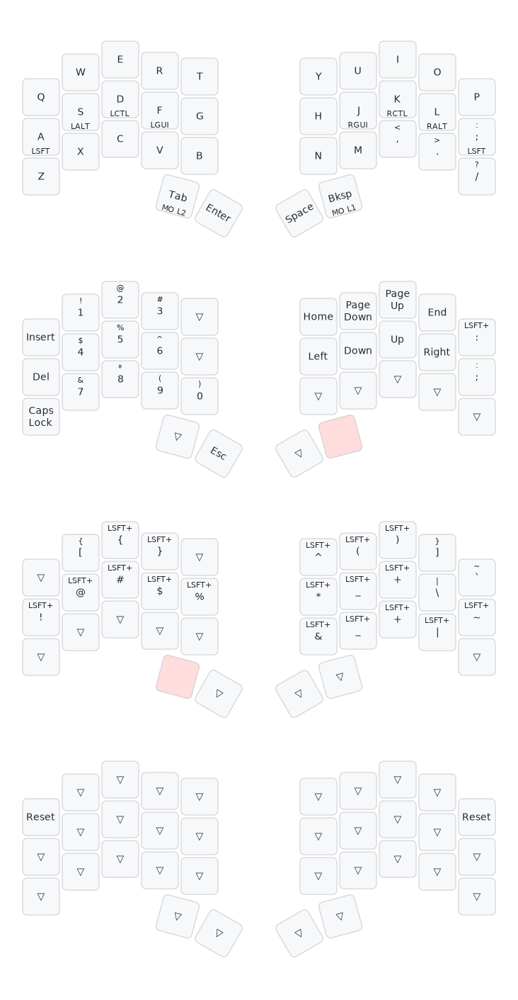

# RMK 

RMK is a feature-rich and easy-to-use keyboard firmware.
https://github.com/haobogu/rmk

## Keymap
Outdated image
<!--  -->

## Use the template

1. Setup enviornment

   ```shell
   cargo install cargo-make
   ```
   
2. Build the firmware

   ```shell
   cargo build --release
   ```

3. Build uf2 files

   ```shell
   cargo make uf2 --release
   ```
